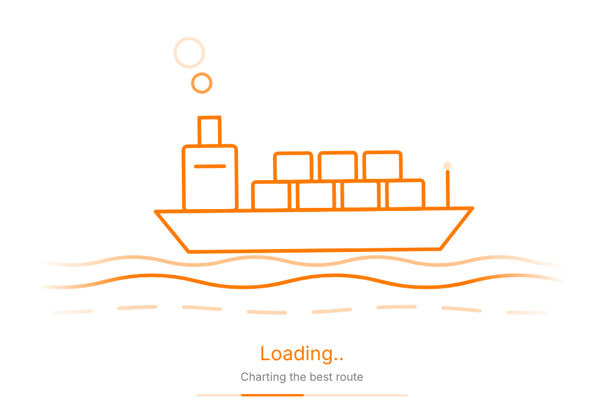

# Pricing-Transp-Navy

## Marine loading component (`cmpMarineLoader`)

A minimalist, single-colour loading overlay for Power Apps canvas apps. An outlined container ship bobs on scrolling wave lines, with smoke rings rising from the funnel and a blinking mast light. Under the drawing there are animated "Loading..." dots and a thin progress bar that slides back and forth. Everything is orange line art on white by default.



| File | Use |
|---|---|
| `components/cmpMarineLoader.pa.yaml` | Full component definition (custom properties + controls) |
| `components/cmpMarineLoader.controls.paste.yaml` | Controls only, ready for **Paste code** in Studio |

### How it animates

One hidden `Timer` (4 s, repeating) drives everything. The SVG is rebuilt from `tmrMarineLoader.Value`. Every motion completes a whole number of cycles in those 4 s, so the loop has no visible jump. The SVG has no SMIL or CSS animation, so it behaves the same on web, mobile and Teams.

`AccentColor` sets the line colour of the drawing, the main text and the progress bar. The formula converts it to hex for the SVG with `Mid(JSON(color), 2, 7)`. To use another colour, change that one property.

### Add it to your app

1. **Components** tab → **New component** → rename it to `cmpMarineLoader`.
2. Add these custom properties (all **Input**):

   | Name | Type | Default |
   |---|---|---|
   | `IsLoading` | Boolean | `true` |
   | `LoadingText` | Text | `"Loading"` |
   | `SubText` | Text | `"Charting the best route"` |
   | `AccentColor` | Color | `RGBA(255, 122, 0, 1)` |
   | `BackgroundColor` | Color | `RGBA(255, 255, 255, 1)` |

3. Set the component's `Fill` to `cmpMarineLoader.BackgroundColor`. Set its size to 640 × 420 or any size you like. The drawing and text scale with the component, so stretched over a full screen the drawing takes about 70% of the height.
4. Open `cmpMarineLoader.controls.paste.yaml` and copy all of it. Then right-click the component in the Tree view → **Paste code**.

If you use source control or `pac canvas` with `.pa.yaml` sources, you can drop in `cmpMarineLoader.pa.yaml` as is.

### Use it on a screen

Insert the component, stretch it over the screen and bring it to the front:

```
X: =0
Y: =0
Width: =App.Width
Height: =App.Height
Visible: =locIsLoading
IsLoading: =locIsLoading
LoadingText: ="Calculating freight"
SubText: ="Fetching vessel rates"
```

Toggle it around slow work:

```
UpdateContext({ locIsLoading: true });
ClearCollect(colRates, 'Freight Rates');
UpdateContext({ locIsLoading: false })
```

> Timers only run in **Preview** (F5) or the published app, so the scene stays still while you edit in Studio.
